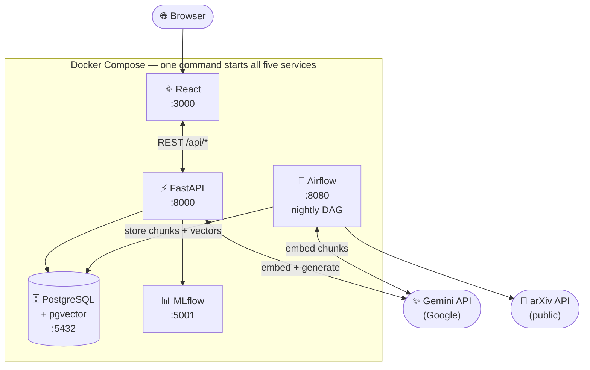
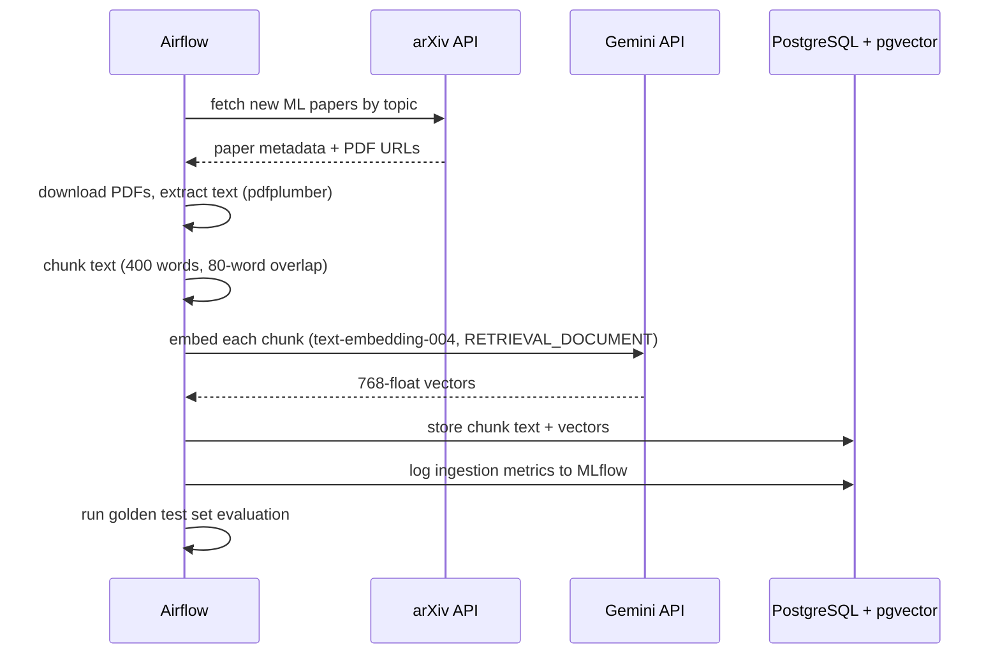
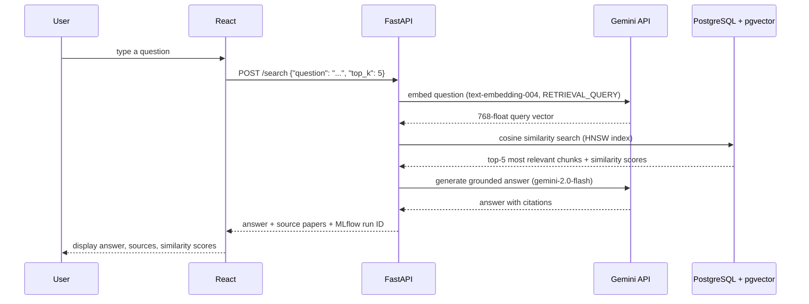

# arxiv-rag

> Semantic search and Q&A over arXiv ML papers — RAG pipeline with Airflow ingestion, MLflow tracking, automated evaluation, FastAPI, pgvector, Gemini API, and React.


---

## What it does

You type a question like *"How does self-attention work?"* and the system searches a corpus of arXiv machine learning research papers it has ingested and indexed. It finds the most semantically relevant passages, then uses Google's Gemini AI to write you a focused answer — with citations back to the exact papers and passages it used.

Behind the scenes, a scheduled Airflow pipeline runs every night to fetch new ML papers from arXiv, extract their text, split it into overlapping chunks, convert each chunk into a 768-dimensional embedding, and store everything in PostgreSQL with pgvector for meaning-based similarity search. Every search query and every nightly ingestion run is tracked in MLflow so accuracy changes are measurable as the corpus grows.

---

## Architecture



### Ingestion flow — Airflow DAG, runs nightly



### Query flow — every user search



---

## Quick Start
> **Prerequisites:** Docker Desktop, a free [Gemini API key](https://aistudio.google.com/app/apikey). No other accounts required.
```
# 1. Clone
git clone https://github.com/dingzehu/arxiv-rag.git
cd arxiv-rag

# 2. One-time setup — generates secrets, creates .env, initialises Airflow
#    (Docker Desktop must be running)
chmod +x setup.sh && ./setup.sh

# 3. Add your GEMINI_API_KEY to .env
#    (setup.sh will remind you — free key at https://aistudio.google.com/apikey)

# 4. Start all services
docker-compose up --build

# 5. Trigger initial ingestion (~3 minutes, fetches 20 papers)
curl -X POST http://localhost:8000/ingest \
  -H "Content-Type: application/json" \
  -d '{"query": "transformer attention mechanism", "max_papers": 20}'
```


| Service | URL | What you see |
|---|---|---|
| React UI | http://localhost:3000 | Search interface |
| FastAPI docs | http://localhost:8000/docs | Interactive API (Swagger UI) |
| Airflow UI | http://localhost:8080 | DAG graph, task logs, run history |
| MLflow UI | http://localhost:5001 | Ingestion metrics, evaluation scores |
| PostgreSQL | localhost:5432 | No browser UI — database only |

---

## Evaluation

The pipeline includes a 30-question golden test set spanning four difficulty levels — including **negative questions that test hallucination resistance** (questions whose answers are deliberately absent from the corpus). The system must respond with "The indexed papers do not contain enough information to answer this question." rather than generating a plausible-sounding but false answer.

Evaluation runs automatically after every nightly Airflow ingestion. All scores are logged to the `arxiv-rag-evaluation` MLflow experiment, making every pipeline change (chunk size, embedding model, top-k) directly measurable against a consistent baseline.

Step 1 — One-time setup: generate the golden test set (run once after initial ingestion, then never again):
```bash
python evaluation/generate_golden_set.py
```
>⚠️ This writes evaluation/golden_test_set.json. Commit that file immediately after generating it and do not regenerate it — all historical MLflow evaluation scores are measured against this fixed baseline. Regenerating it invalidates the entire score history.

Step 2 — To run evaluation manually:

```bash
curl -X POST http://localhost:8000/evaluate/batch
```

---

## Tech Stack

| Layer | Technology |
|---|---|
| API | FastAPI + Uvicorn |
| Database | PostgreSQL 16 + pgvector (HNSW index) |
| ORM | SQLAlchemy 2.0 async |
| LLM + Embeddings | Google Gemini (`gemini-2.0-flash`, `text-embedding-004`) |
| Pipeline | Apache Airflow 2.10 |
| Experiment tracking | MLflow 2.x |
| Frontend | React 18 + Vite |
| Containers | Docker + Docker Compose |
| CI/CD | GitHub Actions |

---

## Design Decisions

- **pgvector over Pinecone or Chroma** — keeps the entire stack inside one `docker-compose up`, zero external API dependency for vector search; HNSW index delivers fast approximate nearest-neighbour search.
- **Airflow over a cron job** — each pipeline stage (fetch, ingest, evaluate) is an independent task with its own retry policy, logs, and success/failure state visible in the Airflow UI; a cron job hides failures silently.
- **MLflow experiment tracking** — every pipeline change is measured against the same 30-question golden test set, so improvements are data-driven rather than assumed. Ingestion config params (chunk size, embedding model) are logged alongside evaluation scores so the two experiments can be directly joined.
- **SequentialExecutor + SQLite for Airflow** — correct choice for a linearly-sequential DAG with no parallel tasks; avoids the Redis + Celery worker overhead LocalExecutor or CeleryExecutor would require for zero practical gain.
- **Gemini-as-judge evaluation** — LLM-based scoring over a fixed golden set with four difficulty levels (including negative/hallucination-detection cases) gives a reproducible quality signal without human annotation overhead.

---

## Project Structure

```
arxiv-rag/
├── backend/
│   ├── app/
│   │   ├── api/          # FastAPI routes
│   │   ├── models/       # SQLAlchemy + Pydantic schemas
│   │   └── services/     # pdf_extractor, chunker, embedder, rag_pipeline, evaluator
│   └── tests/            # pytest unit tests — all external calls mocked
├── airflow/
│   └── dags/             # arxiv_ingestion_dag.py — daily scheduled pipeline
├── evaluation/
│   ├── golden_test_set.json   # 30 curated Q&A pairs (committed, never changes)
│   └── generate_golden_set.py # one-time script to generate the test set
├── frontend/             # React 18 + Vite search UI
├── docker-compose.yml    # all five services
└── .env.example          # required environment variables
```

---

## Development

```bash
# Backend tests — no API keys needed, all external calls mocked
cd backend
pip install -e ".[dev,api]"

# Run unit tests — no API keys needed, all external calls mocked
pytest tests/ -v -m "not integration"

# Integration tests (require real GEMINI_API_KEY + running DB)
pytest tests/ -v -m "integration"

# Lint
ruff check .
```

---

## License

MIT — see [LICENSE](LICENSE).